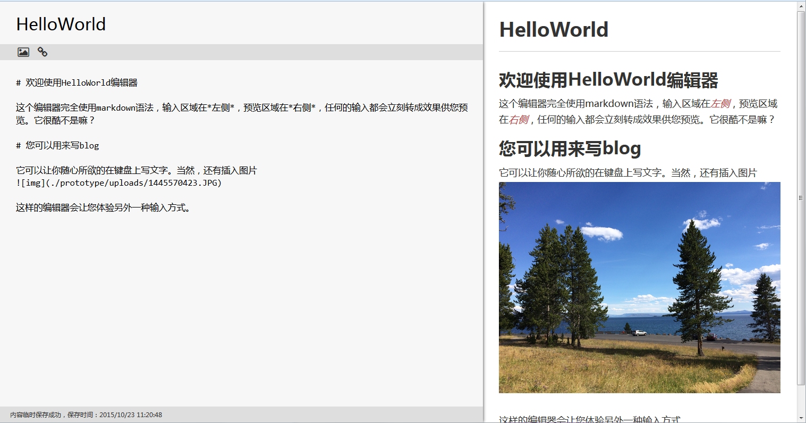

# HelloWorld

记得程序员开始新的技术之旅的时候，一般是以HelloWorld作为TA的第一个成品实验。
这个新的世界将会成为TA未来的职业或生活的一部分。HelloWorld成为了一种文化。

你有没有想过尝试另外一种输入方式呢？想象一下你的编辑器如果只通过键盘来操作是不是很酷？
没错，Markdown语法编辑器会实现你的这个要求。一个简单的textarea，可以完成一切可以看到的基本文字。

HelloWorld诞生了！它是一个文本编辑器，带有几个简化的不能再简化的按钮，大部分的地方，是留给你写字的。
当然，你会发现，当你使用HelloWorld写文章时，右侧同时还有适时的预览。

HelloWorld有

* 引入Marked作为markdown语法的解析器，这是目前bug最少的解析器。
* 一个Textarea搞定所有事情。tab键缩进，整行缩进。支持`![`唤出图片加载窗口。
* 所写即所现。您的markdown文章可以立刻看到效果。

